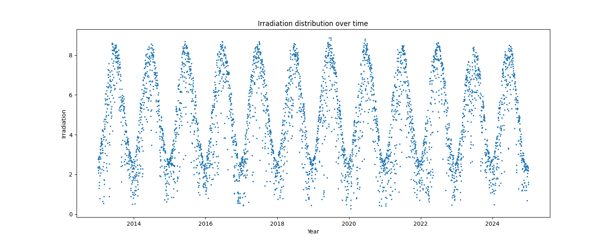
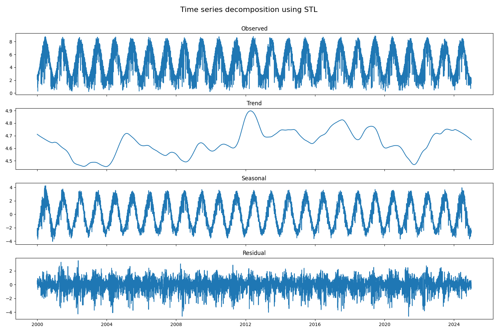

# Solar Irradiation Forecasting Project

## Project Overview

- This project utilizes data from the NASA POWER API to extract solar irradiation, temperature, and precipitation data for Valencia, Spain.
- Key libraries used include XGBoost for machine learning modeling and SARIMA for time series forecasting.
- An important finding from the exploratory data analysis (EDA) is the clear seasonal pattern in irradiation and temperature, peaking in mid-year.
- The final model selected for forecasting is XGBoost, which outperformed the SARIMA model in terms of RMSE and MAE metrics.
- The project employs **MLFlow** for experiment tracking and **DVC** for data versioning, ensuring reproducibility and efficient management of the modeling process.

## Important features

Model tracking was developed using **MLFlow** and its reported in a [Dagshub repository](https://dagshub.com/JohnQuintero08/solar_panel_performance_forecasting) and the best model was registered in the platform. The functions for model excecution were created for report automatically every experiment, including the information related to the data versioning, which was cantroled using **DVC**.

## Motivation

The importance of this project lies in its potential to aid in decision-making regarding the installation of solar panels in Valencia, Spain. By accurately forecasting solar irradiation, stakeholders can assess the viability and profitability of solar energy investments. Given the increasing emphasis on renewable energy sources, this project contributes to the broader goal of sustainable energy solutions.

The tools used in this project, such as XGBoost and SARIMA, are particularly interesting due to their ability to handle complex datasets and capture seasonal patterns effectively. XGBoost, known for its robustness and efficiency in handling large datasets, allows for fine-tuning through hyperparameter optimization, while SARIMA provides a solid foundation for time series analysis. Together, these models offer a comprehensive approach to forecasting solar irradiation, which is crucial for optimizing solar energy production.

## Code and Resources

- Key libraries used in this project include:
  - `pandas`
  - `numpy`
  - `xgboost`
  - `statsmodels`
  - `mlflow`
  - `dvc`
- To install the required libraries, run:
  ```bash
  pip install -r requirements.txt
  ```

## Data Collection

The data was obtained from the NASA POWER API, which provides historical weather and solar condition information for cities worldwide. The API can be accessed at the following link: [NASA POWER API](https://power.larc.nasa.gov/api/temporal/daily/point).

## EDA

The exploratory data analysis revealed several key insights:

- An irregular data point with an irradiance value of -999 was identified and removed to maintain data integrity.
- Seasonal patterns were observed in irradiation and temperature, with peaks around mid-year, as illustrated in the monthly boxplots.

- **Irradiation Distribution**: The sinusoidal behavior of irradiation over the years indicates a seasonal pattern with minimum values around 1 and maximum values above 8.



- **Monthly Irradiation**: The highest irradiation values occur between May and August, while the lowest are from November to February, reflecting the seasonal climate of Valencia.


- **Irradiation Decomposition**: The seasonal decomposition plot shows that while there is no clear trend, the seasonal component can be effectively extracted, indicating cyclical behavior in the data.



## Processing and Feature Engineering

In the feature engineering phase, two parallel models were built to forecast irradiation values. For the XGBoost model, date decomposition, moving averages, and lag features were created. The SARIMA model focused solely on the extracted irradiation values. The dataset was split into training, validation, and test sets with proportions of 70%, 15%, and 15%, respectively, and adapted to monthly averages to reduce computational load.

## Model Building

The project tested two models: XGBoost and SARIMA. The XGBoost model was optimized using hyperparameter tuning, while the SARIMA model was selected for its autoregressive properties.

## Model Performance

The XGBoost model demonstrated superior performance compared to the SARIMA model:

- **XGBoost Model Evaluation**:

  - Train Dataset: RMSE: `0.07`, MAE: `0.04`
  - Validation Dataset: RMSE: `0.08`, MAE: `0.05`
  - Test Dataset: RMSE: `0.12`, MAE: `0.07`

- **SARIMA Model Evaluation**:
  - Validation Dataset: RMSE: `0.36`, MAE: `0.27`

The XGBoost model reduced the RMSE by a factor of 4 compared to the SARIMA model, making it the preferred choice for forecasting.
