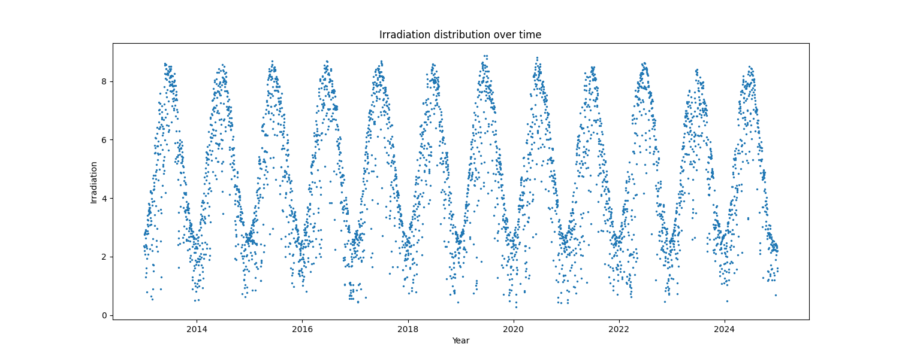
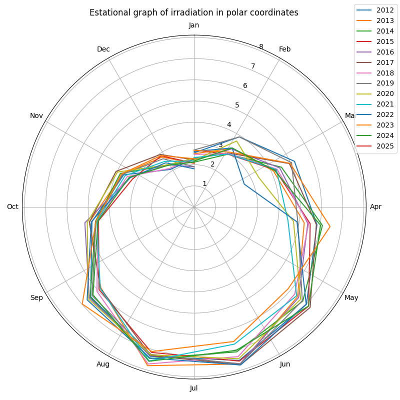
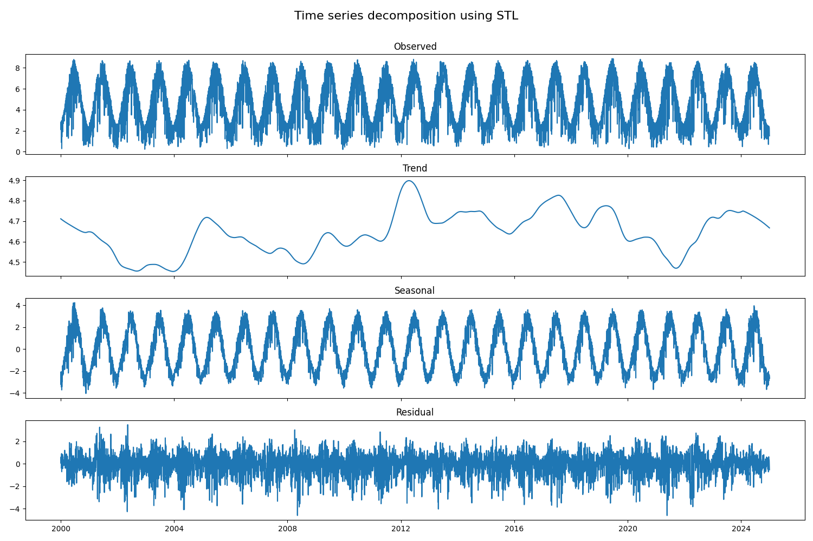

# PLOTS OVERVIEW

- The plot of  shows a sinusoidal and seasonal behavior with annual repetition over the years, having minimum values around 1 and maximum values above 8.

- The plot  shows that the months with the highest irradiation are between May and August, while the lowest values occur from November to February, which corresponds to the summer and winter seasons in Valencia, Spain.

- Finally, the plot  of trend, seasonal, and residual decomposition shows that, considering a lag of 360, the seasonal component of the time series can be extracted. However, there is no clear trend, as the data keeps oscillating over time. Also the white noise is well extracted.
